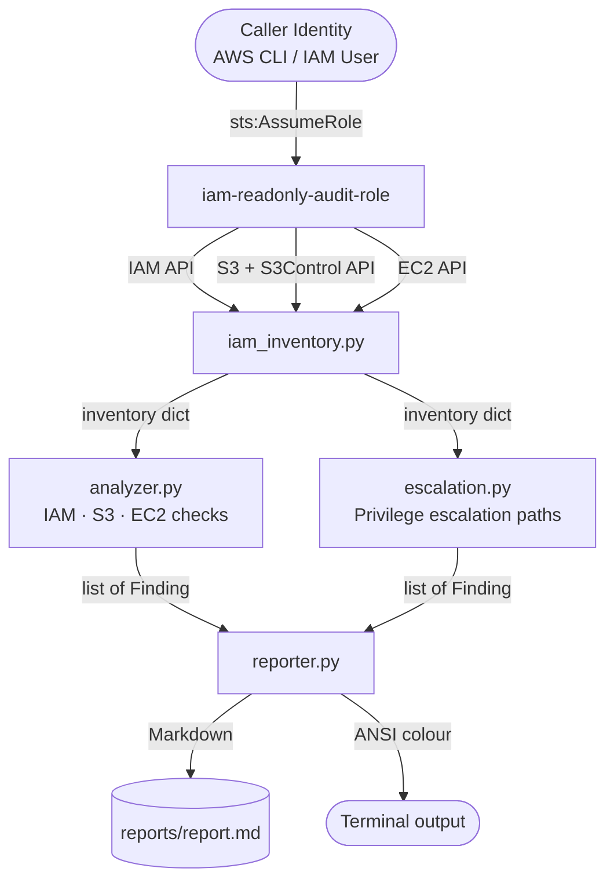

# Architecture

## System Flow

## Data Flow

```mermaid
flowchart LR
    subgraph Collect
        A1[list_users]
        A2[list_roles]
        A3[list_attached_policies_with_documents]
        A4[get_credential_report]
        A5[list_s3_buckets_with_security]
        A6[get_s3_public_access_block_account]
        A7[list_security_groups]
    end

    subgraph Analyse
        B1[check_admin_access\nIAM-001]
        B2[check_mfa_disabled\nIAM-002]
        B3[check_root_account\nIAM-003]
        B4[check_old_access_keys\nIAM-004]
        B5[check_unused_users\nIAM-005]
        B6[check_wildcard_permissions\nIAM-006]
        B7[check_public_s3_buckets\nS3-001]
        B8[check_security_groups\nEC2-001]
        B9[check_escalation_paths\nESC-001 to 006]
    end

    Collect --> Analyse
    Analyse -->|Finding objects| Report[reporter.py]
```

## AWS Services Used

| Service | Purpose | API calls |
|---------|---------|-----------|
| IAM | Users, roles, policies, credential report | list_users, list_roles, list_policies, get_policy_version, generate_credential_report |
| STS | Assume audit role, get account ID | assume_role, get_caller_identity |
| S3 | Bucket ACLs, policies, public access blocks | list_buckets, get_bucket_acl, get_bucket_policy, get_public_access_block |
| S3Control | Account-level public access block | get_public_access_block |
| EC2 | Security group inbound rules | describe_security_groups |
